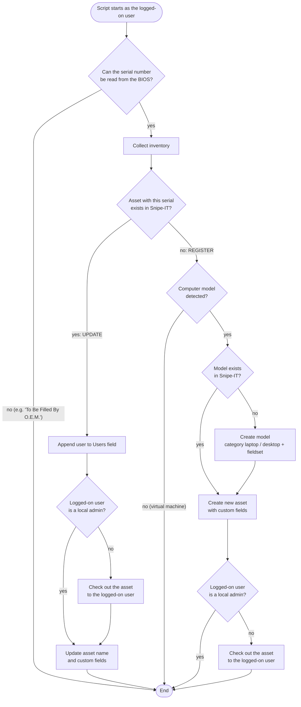

# Snipe-IT – PowerShell automated asset registration and update (Intune / GPO)

PowerShell script that keeps your **[Snipe-IT](https://snipeitapp.com/)** asset inventory up to date automatically. It runs on every Windows computer, collects hardware and software details and **creates or updates the asset in Snipe-IT through the REST API**. The asset is also **checked out to the user who is logged on**.

> 🪟 **Windows only.** The script uses WMI/CIM, the registry, `dsregcmd` and Windows Defender cmdlets. It does not run on macOS or Linux.
>
> 🍎🐧 **Need it for macOS or Linux?** The same automated registration and update can be built for other operating systems too (for example deployed through Intune for macOS, Jamf or a cron job). Get in touch: 📧 [info@duprtech.sk](mailto:info@duprtech.sk)
>
> ➕ **Need more data in Snipe-IT?** Anything that can be read from the computer can be added, for example **TeamViewer / AnyDesk ID**, BitLocker status and recovery key ID, monitors and docking stations, BIOS version, battery health, TPM / Secure Boot, installed software, printers or warranty info. Get in touch: 📧 [info@duprtech.sk](mailto:info@duprtech.sk)

Deploy it with:
- **Microsoft Intune → Remediations** (detection script only, no remediation script needed), or
- **Group Policy → User logon script**

## ✨ Highlights

- 🆕 **Automatic asset creation**: a computer that isn't in Snipe-IT yet is created, matched by **serial number**. The **model** is created too if it doesn't exist (category laptop / desktop detected automatically).
- 🔄 **Automatic updates**: computer name and all custom fields are refreshed on every run
- 👤 **Automatic check-out to the logged-on user**: the asset follows the person who actually uses it. Skipped for local admins (IT staff) and for assets assigned to a location.
- 🧾 **User history**: every user who logged on is appended to a custom field (`user1, user2, …`)
- ✋ **Manual data is kept**: only values that were detected are sent, empty values never overwrite what you entered by hand
- 🐢 **Rate-limit aware**: waits and retries when Snipe-IT returns *429 Too Many Requests*

## What is collected

| Data | Example | Source |
|------|---------|--------|
| Computer name → asset name | `PC-0123` | `%COMPUTERNAME%` |
| Serial number (asset match key) | `PF3ABCDE` | `Win32_BIOS` |
| Model (for new assets) | `Yoga 9 14IRP8`, `OptiPlex 7010` | `Win32_ComputerSystem` / `Win32_ComputerSystemProduct` (Lenovo) |
| Laptop / desktop (category of new models) | `Laptop` | chassis type, or computer name prefix |
| Ethernet MAC / IPv4 | `00:11:22:33:44:55`, `10.0.0.15` | active Ethernet adapter |
| Wi-Fi MAC / IPv4 | `66:77:88:99:AA:BB`, `10.1.0.20` | active Wi-Fi adapter |
| CPU | `13th Gen Intel(R) Core(TM) i7-1360P` | `Win32_Processor` |
| RAM | `16 GB` | `Win32_ComputerSystem` |
| Disks | `[SSD] 953.87 GB` | `Get-PhysicalDisk` |
| Operating system | `Microsoft Windows 11 Pro, Build: 26100` | `Win32_OperatingSystem`, registry |
| OS install date | `2025-09-09` | `Win32_OperatingSystem` |
| Antivirus | `Windows Defender 4.18.26080.4 (2026-10-01)` | `Get-MpComputerStatus` / Security Center |
| Microsoft Office | `Microsoft 365 (16.0.20326.20158)` | Click-to-Run registry |
| Join type | `AD`, `Azure`, `AD, Azure` | `dsregcmd /status` |
| RustDesk ID | `123456789` | RustDesk config / `rustdesk.exe --get-id` |
| Logged-on users history | `jsmith, adoe` | `%USERNAME%` |

Virtual machines (Hyper-V, VMware, Parallels) and computers without a valid serial number are skipped when it comes to creating new models / assets.

## Requirements

- Windows 10 / 11 (or Windows Server) with **Windows PowerShell 5.1**
- **Snipe-IT** with API access, reachable over HTTPS from the computers
- An **API token** of a dedicated Snipe-IT service user (see [Service user and API token](#service-user-and-api-token))
- Snipe-IT users whose **username or e-mail matches the Windows UPN** (for example synced from Entra ID / LDAP), so the asset can be checked out to them

## Setup in Snipe-IT

1. **Create custom fields** for the data you want to store, see [Custom fields](#custom-fields) below.
2. **Add them to a fieldset** (*Settings → Custom Fields → Fieldsets → New Fieldset*, then add the fields to it) and note the fieldset ID. New models get this fieldset. Assign the fieldset also to your **existing models**, otherwise their assets can't store the values.
3. Note the IDs of the **status label** for new assets (*Settings → Status Labels*) and of the **categories** for laptops and desktops (*Settings → Categories*).
4. **Create a service user and its API token**, see below.

### Custom fields

*Settings → Custom Fields → Create New Custom Field*. Create only the ones you want; each one is optional.

| `$FieldMap` key | Suggested field name | Element | Format | Value sent by the script |
|-----------------|----------------------|---------|--------|--------------------------|
| `EthMac` | MAC Address | Text Box | `MAC` | `C0:A5:E8:1E:36:F6` |
| `WifiMac` | MAC Address Wi-Fi | Text Box | `MAC` | `C0:A5:E8:1E:36:F7` |
| `EthIPv4` | IPv4 | Text Box | `IPV4` | `10.0.0.15` |
| `WifiIPv4` | IPv4 Wi-Fi | Text Box | `IPV4` | `10.1.0.20` |
| `RustDeskId` | RustDesk ID | Text Box | `ANY` | `123456789` |
| `RAM` | RAM | Text Box | `ANY` | `16 GB` |
| `CPU` | CPU | Text Box | `ANY` | `13th Gen Intel(R) Core(TM) i7-1360P` |
| `OS` | Operating System | Text Box | `ANY` | `Microsoft Windows 11 Pro, Build: 26100` |
| `Storage` | HDD / SSD | Text Box | `ANY` | `[SSD] 953.87 GB` (more disks: `[SSD, HDD] 476.94 GB, 931.51 GB`) |
| `Antivirus` | Antivirus | Text Box | `ANY` | `Windows Defender 4.18.26080.4 (2026-10-01)` |
| `Office` | Microsoft Office | Text Box | `ANY` | `Microsoft 365 (16.0.20326.20158)` |
| `JoinType` | AD / Azure | Text Box or Radio Buttons | `ANY` | one of: `AD`, `Azure`, `AD, Azure` |
| `OSInstallDate` | OS Install Date | Text Box | `DATE` | `2025-09-09` |
| `Users` | Users | **Text Area** | `ANY` | `jsmith, adoe` (history of logged-on users) |

- **AD / Azure** works as a plain Text Box. If people also edit it by hand in Snipe-IT, you can use **Radio Buttons** instead, so they pick from the same values the script writes. Enter them in *Field Values*, one per line, exactly like this:
  ```
  AD
  Azure
  AD, Azure
  ```
- Leave **Encrypt the value of this field** off (encrypted fields can't be compared or updated by the script).
- After saving, Snipe-IT shows the **DB Field** of each field in the list (for example `_snipeit_ram_6`). Copy these names to `$FieldMap` in the script.
- Fields you don't create: set them to `""` in `$FieldMap`.

### Service user and API token

Don't use your own or an admin account. Create a dedicated user that can do only what the script needs:

1. **Create the user**: *People → Create New*
   - First name: `PowerShell`, Last name: `Updater`
   - Username: for example `powershell.updater`
   - Set a strong password and keep **This user can login** enabled (needed to create the API token)
2. **Set permissions**: open the user → *Edit* → *Permissions* tab, and grant only:

   | Section | Permissions |
   |---------|-------------|
   | **Assets** | View, Create, Edit, Checkout, Checkin |
   | **Asset Models** | View, Create |
   | **Users** | View |
   | **Self** | Create API Keys |

   Leave everything else on *Deny*, and **don't** make the user a Super User or Admin.
3. **Generate the API token**: log in to Snipe-IT **as `powershell.updater`** → user menu (top right) → *Manage API Keys* → *Create New Token*, name it for example `Intune asset sync`.
4. **Copy the token right away**, Snipe-IT shows it only once. Paste it into `$SnipeItApiToken` in the script.

With these permissions the token can't delete anything, change settings or manage users, even if someone reads it from the script.

## Configuration

Edit the `CONFIGURATION` section at the top of `SnipeIT-AssetSync.ps1`:

| Setting | Description |
|---------|-------------|
| `$SnipeItApiUrl` | Snipe-IT API URL, for example `https://snipeit.example.com/api/v1` |
| `$SnipeItApiToken` | API token |
| `$status_id` | Status label ID for new assets |
| `$fieldset_id` | Fieldset ID for new models (`0` = none). **Must exist** and contain your custom fields, otherwise Snipe-IT rejects the custom field values of assets of that model. |
| `$CategoryIdLaptop` / `$CategoryIdDesktop` | Category IDs for new models. Must be existing categories of type **Asset**, otherwise new models (and so new assets) can't be created. |
| `$LaptopHostnamePrefix` | Optional: computers whose name starts with this prefix are laptops (for example `N-`). Empty = detect by chassis type. |
| `$RustDeskExePath` | Optional: RustDesk executable used to read the ID |
| `$UpdateExistingModel` | `$true` = change the model of an existing asset when it differs from the detected one. Default `$false`: keep it off if you name models by hand (for example *Lenovo Yoga 9*), otherwise assets are moved to new, automatically named models. |
| `$AlwaysUpdate` | `$true` = update the asset on every run, `$false` = only when a value changed |
| `$SkipAssignmentForLocalAdmins` | `$true` = don't change the assignment when a local admin logs on |
| `$FieldMap` | Snipe-IT **DB Field** name for every value. Leave a value empty (`""`) to skip it. |

Test it on one computer, logged on as a normal user:
```powershell
powershell.exe -ExecutionPolicy Bypass -File .\SnipeIT-AssetSync.ps1
```

## Deployment

The script must run **as the logged-on user**, because it reads the user name / UPN to check the asset out to that user.

### Microsoft Intune – Remediations

*Devices → Scripts and remediations → Remediations → Create*

| Setting | Value |
|---------|-------|
| Detection script file | `SnipeIT-AssetSync.ps1` |
| Remediation script file | *(none)* |
| Run this script using the logged-on credentials | **Yes** |
| Enforce script signature check | No (or sign the script) |
| Run script in 64-bit PowerShell | **Yes** |
| Schedule | for example **Daily** |

The script always exits with code `0`, so Intune reports the device as *Without issues*. The output (for example `Asset updated with ID: 123`) is shown in the *Pre-remediation detection output* column.

### Group Policy – logon script

*User Configuration → Policies → Windows Settings → Scripts (Logon/Logoff) → Logon → PowerShell Scripts → Add*

- Script: `\\your-domain\NETLOGON\SnipeIT-AssetSync.ps1`

The script then runs at every user logon.

## Security

- The API token is stored in the script in plain text, and the script runs as a normal user. **Every user of the computer can read it** (Intune keeps a temporary copy, GPO runs it from NETLOGON). Use the **dedicated service user with minimal permissions** described in [Service user and API token](#service-user-and-api-token), never a token of an administrator account.
- If the token leaks, delete it in *Manage API Keys* of the service user and create a new one. Then update the script, nothing else needs to change.
- Don't commit a script with a real token to a public repository.

## How it works



- **Serial number in the BIOS**: the only way to recognise the computer. Without it the script can't tell whether the asset already exists, so it stops.
- **Serial number not in Snipe-IT**: the computer is new, so the asset (and its model, if needed) is **created**.
- **Serial number already in Snipe-IT**: the existing asset is **updated**.

## Custom work & support

Need something extra? I can extend or customize this script for your company's needs, for example more inventory data, macOS / Linux support, integration with Intune / Entra ID or other asset management systems. Feel free to get in touch: 📧 [info@duprtech.sk](mailto:info@duprtech.sk)

If this script saved you time and you're happy with my work, you can buy me a coffee ☕

[](https://ko-fi.com/duprtech)

## License

[MIT](LICENSE)
